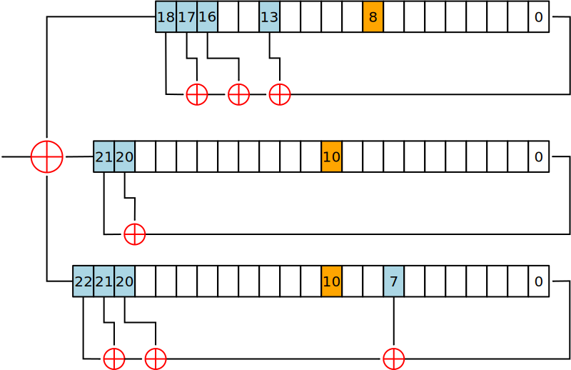

# A5/1算法说明

## 整体流程



## 初始化

1. 将三个寄存器内所有位全都赋值为0

2. 将三个寄存器做64次移位操作,每第$i$次操作,寄存器的反馈内容都先与密钥中的第$i$位进行$xor$,然后把这样$xor$结果作为寄存器此次的反馈内容.三个LSFR都要并行的做这样工作64次.

3. 将三个寄存器做22次的移位操作,每第$i$次操作,寄存器的反馈项都先与帧序号(表示数据包的顺序,实验中可随机生成)的第$i$位进行$xor$,将$xor$的结果作为寄存器的最终反馈内容,同样,三个LSFR也要并行做22次.

完成以上三步后,此时三个LSFR的状态合称为$S0$状态.

## 计算

$maj(X[8],Y[10],Z[10])$即取出现次数较多的数字,例如$maj(1,0,1)=1;maj(0,0,1)=0$

假设三个寄存器为$X[0:18]$,$Y[0:21]$和$Z[0:22]$,其中$X[8]$,$Y[10]$和$Z[10]$为控制部分,当$X[8]=maj(X[8],Y[10],Z[10])$时,$X$寄存器左移输出并通过计算填充空缺,其余同理.

1. 混乱

   三个LFSR以钟控的方式连续运动100次,不进行任何输入,打乱LFSR中的内容

2. 获得密钥

   同样，三个LFSR以钟控的方式连续运动114次，将得到的输出进行$xor$，获得密钥

## 文件说明

- convert_pic:转换图片
      - convert_jpg2hex.py:图片转16进制
      - custom_args.py:处理参数和图像函数
      - draw.py:16进制画图
- verilog:Verilog代码
      - a5_1.v:A5/1算法主要代码
      - a5_1_tb.v:A5/1算法加密
      - a5_1_decrypt_tb.v:A5/1算法解密

## 使用

安装iverilog和vvp,使用make即可

```bash
make enc.sim   //加密
make dec.sim   //解密
make clean     //清理中间文件
```
